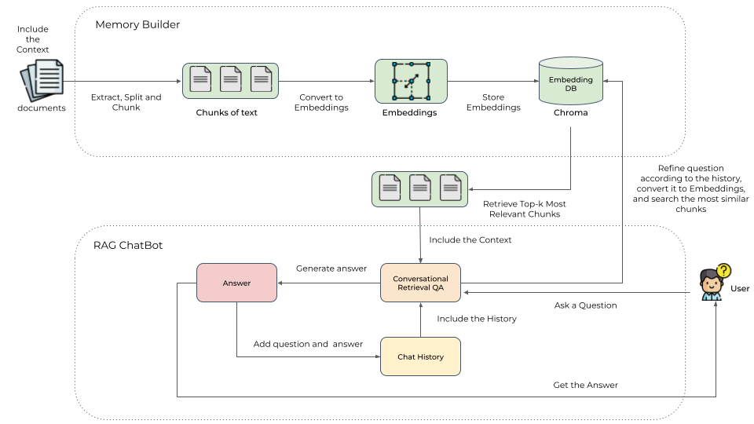
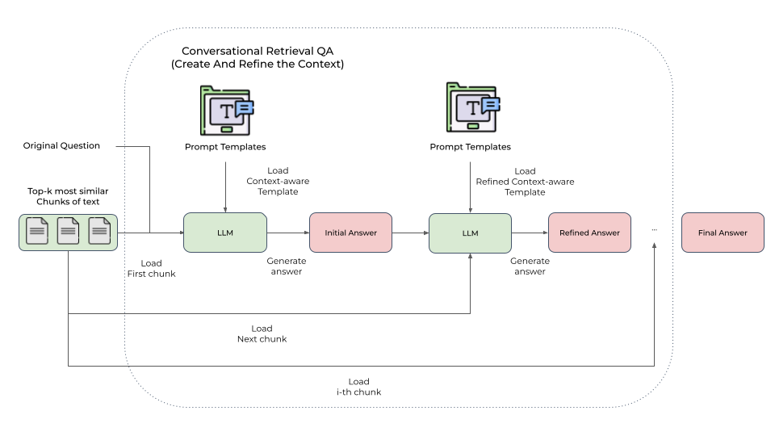
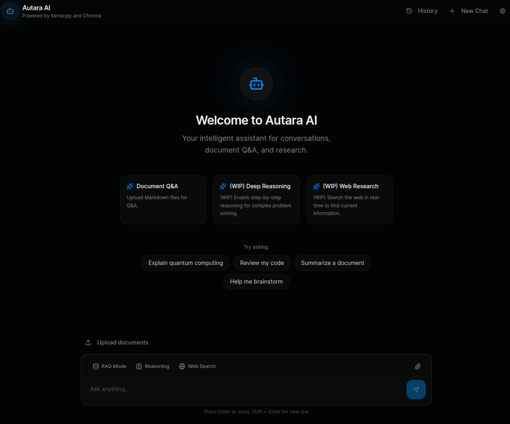

# RAG (Retrieval-augmented generation) ChatBot

Check out the todo list to see the next steps and improvements we want to implement in this project [here](notes/todo.md).

> [!IMPORTANT]
> Disclaimer:
> The code has been tested on:
>   * `Ubuntu 26.04 LTS` running on a Lenovo Legion 5 with twenty `13th Gen Intel® Core™ i7-13650HX` and
      an `NVIDIA GeForce RTX 4060`.
>
> If you are using another Operating System or different hardware, and you can't load the models, please
> take a look at the official llama.cpp's GitHub [issue](https://github.com/ggml-org/llama.cpp/issues).

## Table of contents

- [Introduction](#introduction)
- [Prerequisites](#prerequisites)
    - [Install Poetry](#install-poetry)
- [Bootstrap Environment](#bootstrap-environment)
    - [How to use the make file](#how-to-use-the-make-file)
    - [Environment](#environment)
    - [Set the Open-Source LLM Model](#set-the-open-source-llm-model)
    - [Set the Embedding Model](#set-the-embedding-model)
    - [Set the Response Synthesis strategy](#set-the-response-synthesis-strategy)
- [Build the memory index](#build-the-memory-index)
- [Run the Chatbot](#run-the-chatbot)
- [References](#references)

## Introduction

This project combines the power of [llama.cpp](https://github.com/ggml-org/llama.cpp) and [Chroma](https://github.com/chroma-core/chroma) to build:

* a Conversation-aware Chatbot (ChatGPT like experience).
* a RAG (Retrieval-augmented generation) ChatBot.

The RAG Chatbot works by taking a collection of Markdown files as input and, when asked a question, provides the
corresponding answer based on the context provided by those files.



The `Memory Builder` component of the project loads Markdown pages from the `docs` folder.
It then divides these pages into smaller sections, calculates the embeddings (a numerical representation) of these
sections with the [Semantic Search](https://sbert.net/examples/sentence_transformer/applications/semantic-search/README.html) models
from [Sentence Transformers](https://sbert.net/index.html), and saves them in an embedding database called [Chroma](https://github.com/chroma-core/chroma) for later use.

When a user asks a question, the RAG ChatBot retrieves the most relevant sections from the Embedding database.
Since the original question can't be always optimal to retrieve for the LLM, we first prompt an LLM to rewrite the
question, then conduct retrieval-augmented reading.
The most relevant sections are then used as context to generate the final answer using a local language model (LLM).
Additionally, the chatbot is designed to remember previous interactions. It saves the chat history and considers the
relevant context from previous conversations to provide more accurate answers.

To deal with context overflows, we implemented two approaches:

* `Create And Refine the Context`: synthesize a responses sequentially through all retrieved contents.
    * 
* `Hierarchical Summarization of Context`: generate an answer for each relevant section independently, and then
  hierarchically combine the answers.
    * 

The `Memory Builder` builds the vector database in an incremental way, which means that when a document changes,
we only update the corresponding chunks in the vector store instead of rebuilding the whole index.

This is achieved through:
- **Document-level metadata tracking**: every chunk gets tagged with a source doc ID + version hash. When a doc changes, we regenerate chunks for that doc only, delete the old ones by metadata filter, and insert new ones. way cheaper than rebuilding the whole index.
- **Incremental ingestion pipeline**: the pipeline diffs source docs against what's already indexed (using those version hashes). Only changed/new docs get processed. Keeps compute costs reasonable as the corpus grows.
- **Handling deletions**: we keep a separate mapping table (doc_id → chunk_ids) in a `SQLite` db so we can precisely target what to remove without scanning the whole store.

> [!IMPORTANT]
> One thing to watch out for — if you ever swap embedding models, you must rebuild it from scratch since the vector spaces won’t be compatible. Plan for that early.

## Prerequisites

* Python 3.12+
* GPU supporting CUDA 12.4+
* uv
* [Docker](https://docs.docker.com/engine/install/) 24.0.6+ and [Docker Compose](https://docs.docker.com/compose/install/) 5.0.2+
* [NVIDIA Container Toolkit installed](https://github.com/NVIDIA/nvidia-container-toolkit) (optional, for CUDA support)
  * See [notes/llama-server-docker.md](notes/technical/llamacpp/server-docker.md#installing-nvidia-container-toolkit).

For the UI:
* Node 22.12+
* Yarn 1.22+

## Bootstrap Environment

To easily install the dependencies and start the services we created a make file.

### How to use the make file

* Check: ```make check```
    * Use it to check that `which pip3` and `which python3` points to the right path.
* Setup:
    * Setup with NVIDIA CUDA acceleration: ```make setup```
        * Creates an environment and installs all dependencies with NVIDIA CUDA acceleration.
    * It starts `llama.cpp` server locally via Docker compose.
* Start: ```make start```
    *  Start both the backend and frontend ensuring that the backend is running and ready before launching the frontend.
* Start llama.cpp server
    * on CUDA: ```make start_llama_server```
    * Start the llama.cpp server locally via Docker compose.
    * It will be available at http://0.0.0.0:8080 (it will show the llama-ui).
* Stop `llama.cpp` Server: ```make stop_llama_server```
    * Stop the llama.cpp server if it's running locally.
* Update: ```make update```
    * Update an environment and installs all updated dependencies.
* Tidy up the code: ```make tidy```
    * Run Ruff check and format.
* Clean: ```make clean```
    * Removes the environment and all cached files.
* Test: ```make test```
    * Runs all tests.
    * Using [pytest](https://pypi.org/project/pytest/)

### Environment

Copy .𝐞𝐧𝐯.𝐞𝐱𝐚𝐦𝐩𝐥𝐞 → .𝐞𝐧𝐯 and fill it in.

Copy /frontend/.𝐞𝐧𝐯.𝐞𝐱𝐚𝐦𝐩𝐥𝐞 → .𝐞𝐧𝐯 and fill it in.

To install the UI dependencies, run:

```shell
cd frontend
nvm use
npm install -g yarn
yarn

# Create .env file
echo "VITE_API_URL=http://localhost:8000" > .env
```

### Set the Open-Source LLM Model

`llama-cpp` serves as a C++ backend designed to work efficiently with transformer-based models, which runs either on a `CPU` or `GPU`.
It uses quantized models which are stored in [GGML/GGUF](https://medium.com/@phillipgimmi/what-is-gguf-and-ggml-e364834d241c) format.

We can load whatever `GGUF` model we want from [HuggingFace](https://huggingface.co/).

In the .𝐞𝐧𝐯 we need to set the `MODEL` variable with the name of the model we want to load, and the `MODEL_URL` variable with the URL of the model in GGUF format:
```
MODEL="Meta-Llama-3.1-8B-Instruct-Q4_K_M"
MODEL_URL="https://huggingface.co/bartowski/Meta-Llama-3.1-8B-Instruct-GGUF/resolve/main/Meta-Llama-3.1-8B-Instruct-Q4_K_M.gguf"
```

> [!IMPORTANT]
> The Chatbot must be restarted after changing the model.

The chosen model will be downloaded in the `/models` folder and loaded in the `llama.cpp` server.

> [!NOTE]
> We can load models that fits our hardware capacity and speed requirements.
> To decide which hardware to use/buy to host local LLMs we recommend to read this great benchmarks:
> - [Performance of llama.cpp on Nvidia CUDA](https://github.com/ggml-org/llama.cpp/discussions/15013)
> - [Performance of llama.cpp on Apple Silicon M-series](https://github.com/ggml-org/llama.cpp/discussions/4167)
>
> **Decision model:**
> - `Memory capacity` is the main limit. Check if the model fits in memory (with quantization):
>   - [CanIRun.ai](https://www.canirun.ai/) - Find out which AI models your machine can actually run.
>   - [whichllm](https://github.com/Andyyyy64/whichllm) - Auto-detects your GPU/CPU/RAM and ranks the top models from `HuggingFace` that fit your system.
> - `Memory bandwidth` mostly determines speed (tokens/sec). Check if the bandwidth gives an acceptable speed.
> - If not, upgrade hardware or optimize the model.
>
> For instance, it seems better to buy a second-hand or refurbished Mac Studio M2 Max with at least 64GB RAM,
> since it has 400Gbps of memory bandwidth compared to the M4 Pro, which has just 273Gbps.

We recommend to start with `Qwen 3.5 9B` or `Meta Llama 3.2 Instruct 3B` since they are small enough to run on a cheap GPU with 6GB of VRAM and try larger models like `gpt-oss 120B` if you have the right capacity.

We also recommend few models to start in the table below.

| 🤖 Model                    | Model Size         | Max Context Window | Notes and link to the model card                                                                                                                             |
|-----------------------------|--------------------|--------------------|--------------------------------------------------------------------------------------------------------------------------------------------------------------|
| Qwen 3.6 27B                | 27B                | 262k               | **Recommended model** [Card](https://huggingface.co/unsloth/Qwen3.6-35B-A3B-GGUF)                                                                            |
| Qwen 3.6 35B A3B            | 35B (3B activated) | 262k               | [Card](https://huggingface.co/unsloth/Qwen3.6-27B-GGUF)                                                                                                      |
| Qwen 3.5 0.8B               | 0.8B               | 256k               | Tiny and fast multimodal, great for edge device - [Card](https://huggingface.co/unsloth/Qwen3.5-0.8B-GGUF)                                                   |
| Qwen 3.5 2B                 | 2B                 | 256k               | Multimodal for lightweight agents (small tool calls) - [Card](https://huggingface.co/unsloth/Qwen3.5-2B-GGUF)                                                |
| Qwen 3.5 4B                 | 4B                 | 256k               | Doesn’t drift from tasks as bad as 2B [Card](https://huggingface.co/unsloth/Qwen3.5-4B-GGUF)                                                                 |
| Qwen 3.5 9B                 | 9B                 | 256k               | **Recommended model** Can handle more complex tasks and competes with larger models like gpt-oss 120B [Card](https://huggingface.co/unsloth/Qwen3.5-9B-GGUF) |
| Meta Llama 3.2 Instruct     | 1B                 | 128k               | Optimized to run locally on a mobile or edge device - [Card](https://huggingface.co/bartowski/Llama-3.2-1B-Instruct-GGUF)                                    |
| Meta Llama 3.2 Instruct     | 3B                 | 128k               | Optimized to run locally on a mobile or edge device - [Card](https://huggingface.co/bartowski/Llama-3.2-3B-Instruct-GGUF)                                    |
| Meta Llama 3.1 Instruct     | 8B                 | 128k               | **Old but still recommended** [Card](https://huggingface.co/bartowski/Meta-Llama-3.1-8B-Instruct-GGUF)                                                       |
| DeepSeek R1 Distill Qwen 7B | 7B                 | 128k               | **Experimental** [Card](https://huggingface.co/bartowski/DeepSeek-R1-Distill-Qwen-7B-GGUF)                                                                   |

### Set the Embedding Model

For the semantic search, we support all the embedding models from `Sentence Transformers` but we tested those on the table below.

In the .𝐞𝐧𝐯 we need to set the `EMBEDDING_MODEL` variable with the name of the model we want to load:
```
EMBEDDING_MODEL="all-MiniLM-L6-v2"
```

To find the list of best embeddings models for the retrieval task in the language (or multiple languages) go to the [Massive Text Embedding Benchmark (MTEB) Leaderboard](https://huggingface.co/spaces/mteb/leaderboard).
We do recommend to use the [jina-embeddings-v5-text](https://huggingface.co/collections/jinaai/jina-embeddings-v5-text) models,
which are small (239M & 677M parameters) with SOTA performance for multilingual retrieval tasks, and they perform very well on the MTEB benchmark.

| 🧠 Embedding Model                                                               | Supported | Model Size | Max Tokens | Retrieval score (MTEB) | Notes and link to the model card                                                                    |
|----------------------------------------------------------------------------------|-----------|------------|------------|------------------------|-----------------------------------------------------------------------------------------------------|
| `all-MiniLM-L6-v2` - Sentence Transformers All MiniLM L6 v2                      | ✅         | 0.023B     | 512        | 33.30                  | [Card](https://huggingface.co/sentence-transformers/all-MiniLM-L6-v2)                               |
| `all-MiniLM-L12-v2` - Sentence Transformers All MiniLM L12 v2                    | ✅         | 0.033B     | 256        | 33.37                  | [Card](https://huggingface.co/sentence-transformers/all-MiniLM-L12-v2)                              |
| `all-mpnet-base-v2` - Sentence Transformers All Mpnet base v2                    | ✅         | 0.109B     | 384        | 33.80                  | [Card](https://huggingface.co/sentence-transformers/all-mpnet-base-v2)                              |
| `jinaai/jina-embeddings-v5-text-small-retrieval` - jina-embeddings-v5-text-small | ✅         | 0.596B     | 32k        | 64.88                  | **Recommended model** [Card](https://huggingface.co/jinaai/jina-embeddings-v5-text-small-retrieval) |
| `jinaai/jina-embeddings-v5-text-nano-retrieval` - jina-embeddings-v5-text-nano   | ✅         | 0.212B     | 8k         | 63.26                  | [Card](https://huggingface.co/jinaai/jina-embeddings-v5-text-nano-retrieval)                        |

### Set the Response Synthesis strategy

In the .𝐞𝐧𝐯 we need to set the `SYNTHESIS_STRATEGY` variable with the name of the strategy we want to use for the response synthesis:
```
SYNTHESIS_STRATEGY="tree-summarization"
```

| ✨ Response Synthesis strategy                                           | Supported | Notes |
|-------------------------------------------------------------------------|-----------|-------|
| `create-and-refine` Create and Refine                                   | ✅         |       |
| `tree-summarization` **Recommended** - Tree Summarization               | ✅         |       |


## Build the memory index

We can download some Markdown pages from the [Transformers Repo](https://github.com/huggingface/transformers/tree/main/docs/source/en) or anything you like and put them under `docs`.

Build the memory index by running:

```shell
make migrate_db
cd scripts && PYTHONPATH=.:../backend python memory_builder.py --model-name jinaai/jina-embeddings-v5-text-small-retrieval --chunk-size 1000 --chunk-overlap 50
```

## Run the Chatbot

The Chatbot has a UI built with `Vite`, `React` and `TypeScript`, and a backend built with `FastAPI` that serves the LLMs through `llama.cpp` server.

To start both the backend and frontend ensuring that the backend is running and ready before launching the frontend just run:

```shell
make start
```

The application will be available at http://localhost:5173, with the backend API at http://localhost:8000.



We can enable the RAG Mode feature in the UI to ask questions based on the context provided by the Markdown files you loaded and indexed in the previous step:


We can also upload a Markdown file using the file uploader.
The document management section shows the uploaded and indexed documents.
Once we upload one or multiple files, they will be: uploaded → chunked → embedded → upserted to Chroma.


